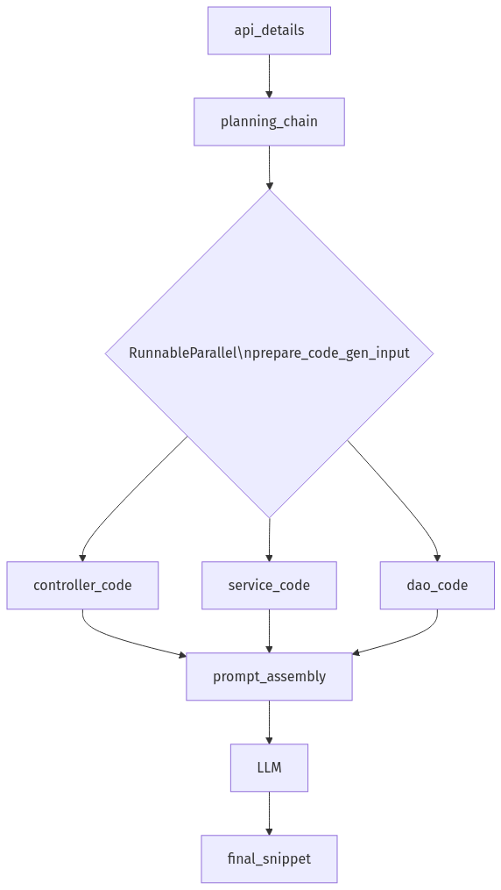

# LangChain Chat Functionality

## Overview

LangChain provides a robust framework for building chat-based applications with language models. The chat functionality includes support for different message types, conversation management, response caching, and persistent chat history.

## Basic Chat Interaction

### Chat Models and Message Types

LangChain supports various chat models through a unified interface. You can initialize a chat model using the `init_chat_model` function:

```python
from langchain.chat_models import init_chat_model
from langchain_core.messages import HumanMessage, SystemMessage, AIMessage

model = init_chat_model("gemini-2.0-flash-001", model_provider="google_genai")
```

LangChain provides different message types to structure conversations:

- `SystemMessage`: Instructions or context for the model
- `HumanMessage`: User inputs
- `AIMessage`: Model responses

### Simple Chat Example

```python
messages = [
    SystemMessage("You are a helpful assistant named Bob"),
    HumanMessage("Hi, what can you tell me about LangChain?"),
]

response = model.invoke(messages)
print(response.content)
```

### Dictionary-Based Format

LangChain also supports a dictionary-based format for messages, which can be more convenient in some scenarios:

```python
messages = [
    {
        "role": "system",
        "content": "Keep talking back to me in a random language of your choice"
    },
    {
        "role": "user",
        "content": "Hi!!!"
    }
]
response = model.invoke(messages)
```

This dictionary format maps directly to the message structure used by many LLM APIs, making it easier to work with different providers.

## Managing Conversations

### Append Messages

You can build multi-turn conversations by appending messages to the conversation history:

```python
# Add the AI's response to the conversation
messages.append(AIMessage(content=response.content))

# Add the next user message
messages.append(HumanMessage("Can you provide more details?"))

```

### Append Dictionary Messages

```python
messages.append(
    {
        "role": "ai",
        "content": response.content,
        "response_metadata": response.response_metadata
    }
)

messages.append(
    {
        "role": "user",
        "content": "How are you feeling today ?"
    }
)
```

### Get the next response

```python
response = model.invoke(messages)
```

## Model Configuration

LangChain allows you to configure various parameters for the chat models:

```python
model = init_chat_model(
    model="gemini-2.0-flash-001",
    model_provider="google_genai",
    temperature=0.7,  # Controls randomness (0-1)
    max_tokens=100,   # Limits response length
    top_p=0.9,        # Controls token selection diversity
    frequency_penalty=0.5,  # Reduces repetition
    presence_penalty=0.5    # Encourages new topics
)
```

## Response Caching

LangChain provides caching mechanisms to improve performance and reduce API costs:

### In-Memory Cache

```python
from langchain_core.caches import InMemoryCache
from langchain_core.globals import set_llm_cache

set_llm_cache(InMemoryCache())
```

### Persistent Cache with SQLite

```python
from langchain_community.cache import SQLiteCache
from langchain_core.globals import set_llm_cache

set_llm_cache(SQLiteCache(database_path="./langchain.db"))
```

## Chat History Persistence

LangChain offers tools to persist chat history across sessions:

```python
from langchain_community.chat_message_histories import SQLChatMessageHistory

chat_message_history = SQLChatMessageHistory(
    session_id="unique_session_id",
    connection="sqlite:///langchain.db"
)

# Add messages to history
chat_message_history.add_message(SystemMessage("You are a helpful assistant"))
chat_message_history.add_user_message("Hello")

# Retrieve messages
conversation = chat_message_history.messages

# Clear history when needed
chat_message_history.clear()
```

# LangChain Prompt Templates

## Overview

Prompt templates in LangChain provide a structured way to create and manage prompts for language models. They allow you to define templates with variables that can be filled in at runtime, making your prompts more dynamic and reusable.

### Key Operations

- `format()` = Template + Variables -> Rendered Prompt Messages (No LLM call)
- `invoke()` = Template + Variables -> Rendered Prompt Messages -> Send to LLM -> Get LLM Response (Includes LLM call)
- `format_messages()`: Specifically renders a ChatPromptTemplate into a list of message objects.
- `format_prompt()`: Renders the template into a PromptValue object that can be converted to string or messages.

## Types of Prompt Templates

### 1. Simple Prompt Templates

The `PromptTemplate` class is used for creating simple text prompts with variables.

```python
from langchain_core.prompts import PromptTemplate

template = """
    Write a {tone} email to {company}
    expressing interest in the {position} position,
    mentioning {skill} as a key strength.
    Keep it to {lines} lines max
"""

llm_with_prompt = PromptTemplate.from_template(template) | llm
```

You can then invoke this template with specific values:

```python
response = llm_with_prompt.invoke(input = {
    "tone" : "professional & confidant",
    "company": "Intuit.com",
    "position" : "Senior Software Engineer",
    "skill" : "Autonomous Agent Development",
    "lines" : 10
})
```

### 2. Chat Prompt Templates

The `ChatPromptTemplate` class allows you to create more complex chat-based prompts with different message types (system, human, AI).

#### Simple Method

```python
template = ChatPromptTemplate(
    [("system", "You are a helpful AI bot. Your name is {name}."),
     ("human", "Hello, how are you doing?"),
     ("ai", "I'm doing well, thanks!"),
     ("human", "{user_input}"),
    ])
```

#### Detailed Method with Message Types

```python
template = ChatPromptTemplate([
    SystemMessagePromptTemplate.from_template("You are a AI recipe assistant specializes in {specialty}. Your name is {name}."),
    HumanMessagePromptTemplate.from_template("Hello, how are you doing?"),
    AIMessagePromptTemplate.from_template("I'm doing well, thanks!"),
    HumanMessagePromptTemplate.from_template("{user_input}"),
])
```

## Best Practices

1. **Separate Logic from Templates**: Keep your prompt templates separate from your application logic for better maintainability.

2. **Use Type Hints**: Provide type hints for your functions that use prompt templates to improve code readability.

3. **Chain Operations**: Use the pipe operator (`|`) to chain prompt templates with LLMs for cleaner code.

4. **Provide Clear Instructions**: In system messages, give clear and specific instructions to guide the model's responses.

5. **Test Different Formats**: Experiment with different prompt structures to find what works best for your specific use case.

# LangChain Expression Language (LCEL)

## Overview

LangChain Expression Language (LCEL) provides a **declarative, pipe-based** syntax for composing chains. Every component that implements the `Runnable` interface—prompts, models, tools, parsers, or your own Python callables—can be connected with the pipe operator (`|`). The output of the runnable on the **left** automatically becomes the input of the runnable on the **right**.

**Why LCEL?**

- **Composability** Build complex workflows from small, testable parts.
- **Uniform API** Every runnable supports `invoke`, `batch`, and `stream`.
- **Observability** Chains can be traced in LangSmith with no code changes.

## How LCEL Works Under the Hood

When you build an LCEL chain, LangChain:

1. **Normalises** every component into a `Runnable`.
2. **Constructs** a directed-acyclic graph (DAG) from the `|`, `.assign()`, and `RunnableParallel` operators.
3. **Executes** that DAG lazily when you call `invoke`, `batch`, or `stream`.
4. **Streams** intermediate results in-process—only nodes that call external services (e.g. an LLM) incur network latency.
5. **Traces** each node automatically via LangSmith for observability.

So the pipe operator is syntactic sugar for wiring nodes inside this execution graph.

## Core Building Blocks

These are the fundamental components you'll use in LCEL chains, presented in order of increasing complexity:

| Component              | Description                                                           |
| ---------------------- | --------------------------------------------------------------------- |
| `Prompt`               | Templates that format variables into messages for the LLM.            |
| `LLM / ChatModel`      | Language models that generate text based on input prompts.            |
| `OutputParser`         | Transforms the raw LLM output into structured types (strings, JSON).  |
| `RunnableLambda`       | Wraps any Python function for use in chains.                          |
| `RunnablePassthrough`  | Passes input through unchanged (preserves context).                   |
| `operator.itemgetter`  | Extracts specific keys from dictionaries.                             |
| `RunnableParallel`     | Runs multiple chains with the same input and collects their results.  |

## Building with LCEL Components

### 1. The Basic Pipe (`|`): Sequential Processing

The pipe operator is the fundamental building block of LCEL, connecting runnables in sequence. Let's look at a simple example that formats a prompt, sends it to an LLM, and extracts the string result:

```python
from langchain_core.prompts import ChatPromptTemplate
from langchain_core.output_parsers import StrOutputParser
from langchain_openai import ChatOpenAI

# Create a prompt template
prompt = ChatPromptTemplate.from_template(
    "Write a short poem about {topic} in the style of {style}."
)

# Initialize the language model
llm = ChatOpenAI(model="gpt-3.5-turbo-0125")

# Create the processing chain with the pipe operator
chain = prompt | llm | StrOutputParser()

# Run the chain
result = chain.invoke({"topic": "artificial intelligence", "style": "Shakespeare"})
print(result)
```

In this example:
1. The prompt template formats the input variables into a prompt
2. The formatted prompt is sent to the LLM
3. The LLM's response is processed by the StrOutputParser to extract just the text content

The pipe operator handles all the data conversion between steps automatically.

#### More Examples of Basic Piping

**Example 1.1: Classification Chain**

```python
from langchain_core.prompts import ChatPromptTemplate
from langchain_core.output_parsers import JsonOutputParser
from langchain_openai import ChatOpenAI

# Create a classification prompt
classify_prompt = ChatPromptTemplate.from_template(
    """Classify the sentiment of the following text as 'positive', 'negative', or 'neutral'.
    Also rate the intensity from 1-5 where 5 is very intense.
    
    Text: {text}
    
    Provide the output as a JSON object with keys 'sentiment' and 'intensity'."""
)

# Create the chain
classifier = classify_prompt | ChatOpenAI(model="gpt-3.5-turbo-0125") | JsonOutputParser()

# Use the chain
result = classifier.invoke({"text": "I absolutely loved the movie! Best one I've seen all year!"})
print(result)  # {'sentiment': 'positive', 'intensity': 5}
```

**Example 1.2: Translation Chain**

```python
from langchain_core.prompts import ChatPromptTemplate
from langchain_core.output_parsers import StrOutputParser
from langchain_openai import ChatOpenAI

# Create a translation prompt
translate_prompt = ChatPromptTemplate.from_template(
    "Translate the following {source_language} text to {target_language}: {text}"
)

# Create the chain
translator = translate_prompt | ChatOpenAI() | StrOutputParser()

# Use the chain
result = translator.invoke({
    "source_language": "English",
    "target_language": "French",
    "text": "Hello, how are you today?"
})
print(result)  # "Bonjour, comment allez-vous aujourd'hui?"
```

### 2. RunnableLambda: Adding Custom Python Logic

A `RunnableLambda` lets you inject any Python callable into your chain. This is useful for data transformations, validation, logging, or other custom processing steps.

```python
from langchain_core.runnables import RunnableLambda
from langchain_core.prompts import ChatPromptTemplate
from langchain_openai import ChatOpenAI
from langchain_core.output_parsers import StrOutputParser
from datetime import datetime
import json

# Custom function to preprocess user input
def preprocess_input(input_dict):
    # Add a timestamp
    input_dict["timestamp"] = datetime.now().isoformat()
    
    # Convert topic to lowercase
    if "topic" in input_dict:
        input_dict["topic"] = input_dict["topic"].lower()
    
    # Log that we processed the input
    print(f"Processing request about {input_dict.get('topic', 'unknown topic')}")
    
    return input_dict

# Create the chain with preprocessing
preprocessor = RunnableLambda(preprocess_input)
prompt = ChatPromptTemplate.from_template("Write a short blog post about {topic}. Current time: {timestamp}")
llm = ChatOpenAI()

chain = preprocessor | prompt | llm | StrOutputParser()

# Run the chain
result = chain.invoke({"topic": "Quantum Computing"})
print(result)
```

#### More Examples of RunnableLambda

**Example 2.1: Data Enrichment with External API**

```python
from langchain_core.runnables import RunnableLambda
import requests

def fetch_weather_data(input_dict):
    """Fetch current weather data for the location in the input."""
    if "location" in input_dict:
        location = input_dict["location"]
        # This is a placeholder - you would use a real weather API
        response = requests.get(f"https://api.weather.example.com/?location={location}")
        
        # In a real application, handle API errors appropriately
        if response.status_code == 200:
            # Add weather data to the input dictionary
            input_dict["weather"] = response.json()
        else:
            input_dict["weather"] = {"error": "Could not fetch weather data"}
    
    return input_dict

weather_enricher = RunnableLambda(fetch_weather_data)
```

**Example 2.2: Custom Logger and Performance Tracker**

```python
from langchain_core.runnables import RunnableLambda
import time
from pprint import pprint

def performance_logger(data):
    """Log the data and measure processing time."""
    start_time = time.time()
    
    # Print what we're processing
    print(f"\n--- Processing Data ---")
    pprint(data, indent=2)
    
    # We need to return the input data unchanged for the next step
    result = data
    
    # Calculate processing time
    processing_time = time.time() - start_time
    print(f"Processing completed in {processing_time:.4f} seconds\n")
    
    return result

# Create a logger that can be inserted between any chain steps
logger = RunnableLambda(performance_logger)

# Use in a chain
chain = prompt | logger | llm | logger | parser
```

### 3. RunnablePassthrough: Preserving Original Context

A `RunnablePassthrough()` forwards input unchanged to the next component. This is essential when you need to maintain the original input while branching the flow or adding derived data.

```python
from langchain_core.runnables import RunnablePassthrough

# Simple passthrough that does nothing but forward the input
passthrough = RunnablePassthrough()

# When invoked with any input, it returns exactly that input
original_input = {"query": "What is LangChain?"}
result = passthrough.invoke(original_input)
print(result)  # {"query": "What is LangChain?"}
```

This becomes more useful in multi-step chains where you need to preserve context:

#### Example 2.2: Adding Metadata (Timestamp, Request ID) to Chain

When building production systems, you often need to attach metadata to the chain output for tracking and debugging:

```python
from langchain_core.runnables import RunnableParallel, RunnableLambda, RunnablePassthrough
from datetime import datetime
import uuid

def generate_metadata(input_value):
    return {
        "timestamp": datetime.utcnow().isoformat(),
        "request_id": str(uuid.uuid4()),
        "input_length": len(input_value) if isinstance(input_value, str) else 0
    }

# Chain that attaches metadata while preserving the original input
processing_chain = RunnableParallel(
    metadata = RunnableLambda(generate_metadata),
    content = RunnablePassthrough()  # Original content preserved
)

# The result structure preserves your input while adding metadata
result = processing_chain.invoke("Process this text")
```

#### Example 2.3: Planning With Original Requirements Preserved

When using an LLM to create a plan, you often want to keep the original requirements alongside the generated plan:

```python
from langchain_core.prompts import ChatPromptTemplate
from langchain_core.output_parsers import JsonOutputParser
from langchain_openai import ChatOpenAI
from langchain_core.runnables import RunnableParallel, RunnablePassthrough

# Create a planning prompt
planning_prompt = ChatPromptTemplate.from_template(
    """Generate a step-by-step plan to accomplish this goal: {goal}
    
    Output the plan as a JSON array of steps, where each step has:
    - 'step_number': integer
    - 'description': string
    - 'estimated_time_minutes': integer
    """
)

# Create a planning chain
llm = ChatOpenAI(model="gpt-3.5-turbo-0125")
planning_chain = planning_prompt | llm | JsonOutputParser()

# Create a parallel chain that keeps the original goal alongside the plan
planner = RunnableParallel(
    plan=planning_chain,
    original_requirements=RunnablePassthrough()
)

# The result contains both the generated plan and the original requirements
result = planner.invoke("Build a personal finance tracking application")
```

### 4. operator.itemgetter: Extracting Dictionary Values

The `operator.itemgetter` utility lets you extract specific keys from dictionaries within your chain. It's particularly useful when a component in your chain outputs a dictionary, but the next component only needs specific values from it.

```python
from operator import itemgetter
from langchain_core.prompts import ChatPromptTemplate
from langchain_openai import ChatOpenAI
from langchain_core.output_parsers import JsonOutputParser

# Create a chain that outputs a structured dictionary
person_info_prompt = ChatPromptTemplate.from_template(
    """Generate a profile for a person with the following characteristics:
    - Name: {name}
    - Age: {age}
    - Profession: {profession}
    
    Return the profile as a JSON object with keys for 'name', 'age', 'profession', 'bio', and 'skills'."""
)

# This chain produces a dictionary with multiple fields
profile_generator = person_info_prompt | ChatOpenAI() | JsonOutputParser()

# Extract just the bio for further processing
bio_extractor = profile_generator | itemgetter("bio")

# Use the extracted bio
bio = bio_extractor.invoke({
    "name": "Alex Chen", 
    "age": "28", 
    "profession": "Data Scientist"
})
print(bio)  # Just the bio text, not the full profile dictionary
```

#### More Examples of itemgetter

**Example 4.1: Extracting Multiple Fields**

```python
from operator import itemgetter

# Extract multiple fields at once
skills_and_bio = profile_generator | itemgetter("skills", "bio")

# Result will be a tuple containing the extracted fields
result = skills_and_bio.invoke({"name": "Jordan Lee", "age": "35", "profession": "Software Engineer"})
print(result)  # (['Python', 'JavaScript', 'Machine Learning', ...], 'Jordan is a software engineer with 10 years of experience...')
```

**Example 4.2: Extracting Nested Fields**

```python
from operator import itemgetter
from functools import partial

# A function to get deeply nested fields
def get_nested(data, *keys):
    current = data
    for key in keys:
        if isinstance(current, dict) and key in current:
            current = current[key]
        else:
            return None
    return current

# Create a chain that extracts a specific nested field
get_first_skill = profile_generator | RunnableLambda(partial(get_nested, keys=["skills", 0]))

# Get just the first skill from the profile
first_skill = get_first_skill.invoke({"name": "Taylor Smith", "age": "42", "profession": "Product Manager"})
print(first_skill)  # 'Leadership'
```

### 5. RunnablePassthrough.assign: Enriching Input Context

The `.assign()` method is a powerful extension of RunnablePassthrough that lets you run additional chains and attach their outputs to the input dictionary. This is crucial for multi-stage reasoning or when the next step needs both original context and derived information.

When you call `RunnablePassthrough.assign(key=runnable)`, it:
1. Takes the input dictionary
2. Runs the specified runnable with that input
3. Adds the result to the input dictionary under the specified key
4. Passes the enriched dictionary to the next step

#### Example 3.1: Outline → Blog Post Generation

This expands on the Sequential Chaining example with more detailed context handling:

```python
from langchain_core.prompts import ChatPromptTemplate, SystemMessagePromptTemplate, HumanMessagePromptTemplate
from langchain_core.output_parsers import StrOutputParser
from langchain_core.runnables import RunnablePassthrough
from langchain_openai import ChatOpenAI

# Initialize language model
llm = ChatOpenAI(model="gpt-3.5-turbo-0125", temperature=0.7)

# Create outline generation prompt with specific instructions
outline_prompt = ChatPromptTemplate.from_messages([
    SystemMessagePromptTemplate.from_template(
        """You are an expert content outliner who creates detailed, well-structured outlines.
        Create an outline with at least 5 major sections, each with 2-3 subsections."""
    ),
    HumanMessagePromptTemplate.from_template("Create a comprehensive outline for an article about {topic}.")
])

# Create blog writing prompt that requires both the original topic and the outline
blog_prompt = ChatPromptTemplate.from_messages([
    SystemMessagePromptTemplate.from_template(
        """You are a professional content writer who creates engaging, informative articles.
        Use the provided outline as a structure, but feel free to add relevant examples and data.
        The article should be at least 1000 words and maintain a conversational tone."""
    ),
    HumanMessagePromptTemplate.from_template(
        """Write a comprehensive article about {topic}.
        
        Use this outline as your guide:
        {outline}
        
        Make the article engaging and informative for a general audience."""
    )
])

# Chain for generating just the outline
outline_chain = outline_prompt | llm | StrOutputParser()

# The full end-to-end chain that generates an outline and then uses it to write the article
blog_chain = (
    RunnablePassthrough.assign(outline=outline_chain)  # Run outline_chain and add its output as "outline"
    | blog_prompt                                      # Feed enhanced input to blog prompt
    | llm                                              # Generate the article with the LLM
    | StrOutputParser()                                # Extract the string content
)

# Generate a complete article with automatic outline generation
article = blog_chain.invoke({"topic": "The Impact of Artificial Intelligence on Healthcare"})
```

#### Example 3.2: Retrieval-Augmented Generation with Document Processing

```python
from langchain_core.runnables import RunnablePassthrough
from langchain_core.output_parsers import StrOutputParser
from langchain_core.prompts import ChatPromptTemplate
from langchain_community.vectorstores import Chroma
from langchain_openai import OpenAIEmbeddings, ChatOpenAI

# Setup vectorstore and retriever
embeddings = OpenAIEmbeddings()
vectorstore = Chroma(embedding_function=embeddings, persist_directory="./chroma_db")
retriever = vectorstore.as_retriever(search_kwargs={"k": 5})

# Create a prompt template for processing the retrieved documents
document_prompt = ChatPromptTemplate.from_template(
    """Extract and synthesize the key information from these documents that relates to: {question}
    
    Documents:
    {context}
    
    Focus only on relevant information to the question."""
)

# Create the final answer prompt that needs both the processed documents and original question
answer_prompt = ChatPromptTemplate.from_template(
    """Answer the user's question based on the provided context.
    
    Question: {question}
    
    Relevant information: {processed_docs}
    
    If the context doesn't contain enough information to answer the question, say so."""
)

# LLM setup
llm = ChatOpenAI(model="gpt-4o-2024-05-13")

# Function to format retrieved documents into a string
def format_docs(docs):
    return "\n\n".join(doc.page_content for doc in docs)

# The RAG chain with document processing step
rag_chain = (
    RunnablePassthrough.assign(
        context=retriever | format_docs,
        processed_docs=lambda inputs: document_prompt.invoke({
            "question": inputs["question"],
            "context": format_docs(retriever.invoke(inputs["question"]))
        }) | llm | StrOutputParser()
    )
    | answer_prompt
    | llm
    | StrOutputParser()
)

# Get a detailed answer with processed document context
answer = rag_chain.invoke({"question": "What are the latest developments in CRISPR technology?"})
```

#### Example 3.3: Multi-perspective Content Generation

```python
from langchain_core.runnables import RunnablePassthrough
from langchain_core.output_parsers import StrOutputParser
from langchain_core.prompts import ChatPromptTemplate
from langchain_openai import ChatOpenAI

# Model setup
llm = ChatOpenAI(model="gpt-3.5-turbo-0125")

# Different perspective prompts
scientific_prompt = ChatPromptTemplate.from_template(
    "Provide a scientific explanation of {topic} with references to research."
)

historical_prompt = ChatPromptTemplate.from_template(
    "Provide a historical overview of {topic} and how understanding has evolved over time."
)

ethical_prompt = ChatPromptTemplate.from_template(
    "Discuss the ethical implications and considerations related to {topic}."
)

# Final synthesis prompt that needs all perspectives
synthesis_prompt = ChatPromptTemplate.from_template(
    """Create a comprehensive analysis of {topic} that synthesizes multiple perspectives.
    
    Scientific perspective: {scientific_view}
    
    Historical perspective: {historical_view}
    
    Ethical perspective: {ethical_view}
    
    Synthesize these viewpoints into a balanced analysis."""
)

# Chain that generates all three perspectives and synthesizes them
multi_perspective_chain = (
    RunnablePassthrough.assign(
        scientific_view=scientific_prompt | llm | StrOutputParser(),
        historical_view=historical_prompt | llm | StrOutputParser(),
        ethical_view=ethical_prompt | llm | StrOutputParser()
    )
    | synthesis_prompt
    | llm
    | StrOutputParser()
)

# Generate a comprehensive, multi-perspective analysis
analysis = multi_perspective_chain.invoke({"topic": "Genome editing in human embryos"})
```

### 6. RunnableParallel: Processing Multiple Paths Simultaneously

`RunnableParallel` allows you to run multiple chains with the same input, collecting their results into a single dictionary. This is essential for tasks that require different perspectives or processing methods.

```python
from langchain_core.runnables import RunnableParallel
from langchain_core.prompts import ChatPromptTemplate
from langchain_openai import ChatOpenAI
from langchain_core.output_parsers import StrOutputParser

# Create various prompt templates for different analysis perspectives
pros_prompt = ChatPromptTemplate.from_template("List the pros of {topic}. Be thorough but concise.")
cons_prompt = ChatPromptTemplate.from_template("List the cons of {topic}. Be thorough but concise.")
history_prompt = ChatPromptTemplate.from_template("Provide a brief history of {topic}.")

# Create the LLM and parser
llm = ChatOpenAI(model="gpt-3.5-turbo-0125")
parser = StrOutputParser()

# Create individual chains
pros_chain = pros_prompt | llm | parser
cons_chain = cons_prompt | llm | parser
history_chain = history_prompt | llm | parser

# Run all three analyses in parallel with the same input
multi_analyzer = RunnableParallel(
    pros=pros_chain,
    cons=cons_chain,
    history=history_chain
)

# Invoke with a single topic
result = multi_analyzer.invoke({"topic": "remote work"})

# Result structure: {"pros": "1. Flexibility...", "cons": "1. Isolation...", "history": "Remote work..."}
print(f"Pros: {result['pros'][:50]}...\n")
print(f"Cons: {result['cons'][:50]}...\n")
print(f"History: {result['history'][:50]}...")
```

#### More Examples of RunnableParallel

**Example 6.1: Multi-Model Comparison**

```python
from langchain_core.runnables import RunnableParallel
from langchain_openai import ChatOpenAI
from langchain_google_genai import ChatGoogleGenerativeAI
from langchain_anthropic import ChatAnthropic
from langchain_core.prompts import ChatPromptTemplate
from langchain_core.output_parsers import StrOutputParser

# Create a standard prompt
prompt = ChatPromptTemplate.from_template("Write a short poem about {subject} in the style of {style}")

# Create chains with different models
openai_chain = prompt | ChatOpenAI(model="gpt-3.5-turbo-0125") | StrOutputParser()
gemini_chain = prompt | ChatGoogleGenerativeAI(model="gemini-1.5-pro-latest") | StrOutputParser()
anthropic_chain = prompt | ChatAnthropic(model="claude-3-haiku-20240307") | StrOutputParser()

# Compare all models in parallel
model_comparison = RunnableParallel(
    openai=openai_chain,
    gemini=gemini_chain,
    anthropic=anthropic_chain
)

# Get responses from all three models at once
results = model_comparison.invoke({
    "subject": "artificial intelligence", 
    "style": "Emily Dickinson"
})
```

**Example 6.2: Multi-Format Output Generation**

```python
from langchain_core.runnables import RunnableParallel
from langchain_core.prompts import ChatPromptTemplate
from langchain_openai import ChatOpenAI
from langchain_core.output_parsers import StrOutputParser, JsonOutputParser

# Create the base prompt about a topic
base_prompt = "Provide information about {topic}"

# Create specialized prompts for different output formats
json_prompt = ChatPromptTemplate.from_template(
    base_prompt + " Format the response as a JSON object with keys: 'summary', 'key_points', and 'references'."
)

markdown_prompt = ChatPromptTemplate.from_template(
    base_prompt + " Format the response as a well-structured markdown document with headings and bullet points."
)

text_prompt = ChatPromptTemplate.from_template(
    base_prompt + " Format the response as plain text, optimized for readability."
)

# Create the model and appropriate parsers
llm = ChatOpenAI()
json_parser = JsonOutputParser()
text_parser = StrOutputParser()

# Create the parallel chains
multi_format_generator = RunnableParallel(
    json_output=json_prompt | llm | json_parser,
    markdown_output=markdown_prompt | llm | text_parser,
    plain_text=text_prompt | llm | text_parser
)

# Generate all formats at once
formats = multi_format_generator.invoke({"topic": "quantum computing"})
```

### 7. Putting It All Together: Advanced API Code Generator

Now we'll examine a complete, sophisticated workflow that demonstrates how all the LCEL components work together to create a powerful API code generator. This example is based on the `2_LLM_Parallel_Chain.py` file, refactored for clarity:

```python
from langchain_core.prompts import ChatPromptTemplate
from langchain_core.output_parsers import JsonOutputParser, StrOutputParser
from langchain_openai import ChatOpenAI
from langchain_core.runnables import RunnableParallel, RunnablePassthrough, RunnableLambda

# Initialize our language model
llm = ChatOpenAI(model="gpt-4o")

# Step 1: Create prompts for different parts of the system

# Prompt to analyze the API requirements and generate a planning contract
plan_prompt = ChatPromptTemplate.from_template(
    """Analyze this REST API endpoint requirement and create contracts for the layers:
    
    Framework: {framework}
    Endpoint Description: {endpoint_description}
    Data Object: {data_object_name}
    
    Return a JSON with keys: 'controller_contract', 'service_contract', 'dao_contract'"""
)

# Prompts for generating code based on the contract
controller_prompt = ChatPromptTemplate.from_template(
    """Generate {framework} controller code based on:
    Contract: {contract}
    Data Object: {data_object_name}"""
)

service_prompt = ChatPromptTemplate.from_template(
    """Generate service layer code based on:
    Contract: {contract}
    Data Object: {data_object_name}"""
)

dao_prompt = ChatPromptTemplate.from_template(
    """Generate DAO code based on:
    Contract: {contract}
    Data Object: {data_object_name}
    Storage: {data_storage_hint}"""
)

# Final assembly prompt
assembly_prompt = ChatPromptTemplate.from_template(
    """Integrate these components into a cohesive API implementation:
    
    Controller: {controller_code}
    Service: {service_code}
    DAO: {dao_code}
    
    Explain how they work together."""
)

# Step 2: Function to prepare inputs for code generation
def prepare_code_inputs(full_context, contract_key):
    """Extract the right data for each code generator"""
    return {
        "framework": full_context["api_details"]["framework"],
        "data_object_name": full_context["api_details"]["data_object_name"],
        "data_storage_hint": full_context["api_details"]["data_storage_hint"],
        "contract": full_context["contract"][contract_key]
    }

# Step 3: Build the planning chain
planning_chain = plan_prompt | llm | JsonOutputParser()

# Step 4: Build parallel code generation chain
code_gen = RunnableParallel(
    controller_code=(
        RunnableLambda(lambda x: prepare_code_inputs(x, "controller_contract"))
        | controller_prompt | llm | StrOutputParser()
    ),
    service_code=(
        RunnableLambda(lambda x: prepare_code_inputs(x, "service_contract"))
        | service_prompt | llm | StrOutputParser()
    ),
    dao_code=(
        RunnableLambda(lambda x: prepare_code_inputs(x, "dao_contract"))
        | dao_prompt | llm | StrOutputParser()
    )
)

# Step 5: Complete pipeline
full_chain = (
    # First generate the plan while preserving original input
    RunnableParallel(
        contract=planning_chain,
        api_details=RunnablePassthrough()
    )
    # Then add the generated code to our context
    | RunnablePassthrough.assign(code=code_gen)
    # Finally assemble everything
    | RunnableLambda(lambda x: {
        "controller_code": x["code"]["controller_code"],
        "service_code": x["code"]["service_code"],
        "dao_code": x["code"]["dao_code"]
    })
    | assembly_prompt | llm | StrOutputParser()
)

# Sample input
api_details = {
    "framework": "Flask",
    "endpoint_description": "Retrieve a specific item using its unique ID.",
    "data_object_name": "Item",
    "data_storage_hint": "In-Memory Python Dictionary"
}

# Generate the complete API implementation
final_code = full_chain.invoke(api_details)
```

This chain demonstrates multiple LCEL concepts working together:

1. **Sequential processing** - Each component feeds into the next with the pipe operator
2. **Custom logic** - `RunnableLambda` processes and transforms data between steps
3. **Context preservation** - `RunnablePassthrough` keeps the original API details available throughout
4. **Parallel execution** - `RunnableParallel` generates code for all three layers simultaneously
5. **Dictionary enrichment** - `RunnablePassthrough.assign` adds generated code to the context

The flow is visualized in the following diagram:



## Best Practices

1. **Start simple** - Begin with straightforward chains and gradually add complexity as needed.
2. **Test components individually** - Verify each component works correctly before combining them.
3. **Use RunnablePassthrough strategically** - Preserve context only when needed for downstream steps.
4. **Prefer parallelism** - Use RunnableParallel for independent operations to improve performance.
5. **Add logging** - Insert logging at key points in your chain to help with debugging.
6. **Handle errors gracefully** - Use try/except in custom functions to prevent chain failures.
7. **Leverage LangSmith traces** - Enable tracing to visualize and debug complex chains.

1. **Isolate components** – test each runnable individually before chaining.
2. **Prefer parallelism** for independent subtasks to reduce latency.
3. **Use `.assign()`** to enrich the input dictionary with intermediate results.
4. **Leverage LangSmith** traces to debug and optimize complex chains.
